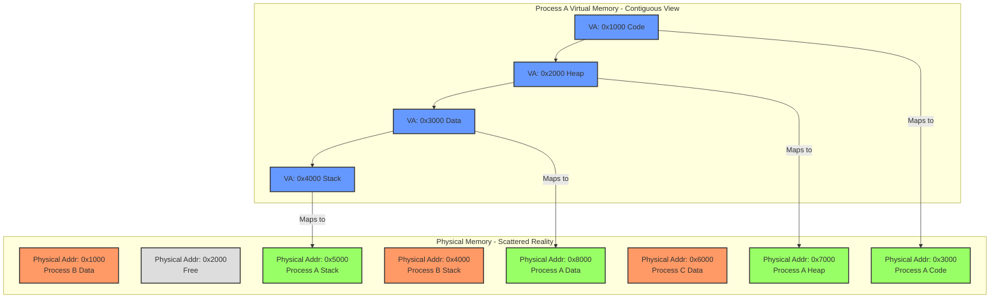

## Paging

```mermaid
graph TD
    subgraph "Process A - Web Browser"
        A1[VA: 0x1000 Code] -->|Maps to| P1[Physical Page 1]
        A2[VA: 0x2000 Data] -->|Maps to| P2[Physical Page 2]
        A3[VA: 0x3000 Stack] -->|Maps to| P3[Physical Page 3]
        A4[VA: 0x4000 Heap] -->|Maps to| PF1[Page File]
        A5[VA: 0x5000 DLL] -->|Maps to| P5[Physical Page 5]
    end

    subgraph "Process B - Text Editor"
        B1[VA: 0x1000 Code] -->|Maps to| P6[Physical Page 6]
        B2[VA: 0x2000 Data] -->|Maps to| P7[Physical Page 7]
        B3[VA: 0x3000 Stack] -->|Maps to| PF2[Page File]
        B4[VA: 0x4000 Heap] -->|Maps to| P9[Physical Page 9]
        B5[VA: 0x5000 DLL] -->|Maps to| P5[Physical Page 5]
    end

    subgraph "Process C - Game"
        C1[VA: 0x1000 Code] -->|Maps to| P10[Physical Page 10]
        C2[VA: 0x2000 Data] -->|Maps to| PF3[Page File]
        C3[VA: 0x3000 Stack] -->|Maps to| P12[Physical Page 12]
        C4[VA: 0x4000 Heap] -->|Maps to| P13[Physical Page 13]
        C5[VA: 0x5000 DLL] -->|Maps to| P5[Physical Page 5]
    end

    classDef pageFile fill:#f96,stroke:#333,stroke-width:2px
    classDef physicalPage fill:#9f6,stroke:#333,stroke-width:2px
    classDef virtualAddress fill:#69f,stroke:#333,stroke-width:2px
    classDef sharedPage fill:#f69,stroke:#333,stroke-width:2px

    class PF1,PF2,PF3 pageFile
    class P1,P2,P3,P6,P7,P9,P10,P12,P13 physicalPage
    class A1,A2,A3,A4,A5,B1,B2,B3,B4,B5,C1,C2,C3,C4,C5 virtualAddress
    class P5 sharedPage
```

```mermaid
graph TD
    subgraph "Process A - Web Browser"
        A1[VA: 0x1000 Code] -->|Lookup| PT1[Page Table Entry 1]
        A2[VA: 0x2000 Data] -->|Lookup| PT2[Page Table Entry 2]
        A3[VA: 0x3000 Stack] -->|Lookup| PT3[Page Table Entry 3]
        A4[VA: 0x4000 Heap] -->|Lookup| PT4[Page Table Entry 4]
    end

    subgraph "Process B - Text Editor"
        B1[VA: 0x1000 Code] -->|Lookup| PT5[Page Table Entry 5]
        B2[VA: 0x2000 Data] -->|Lookup| PT6[Page Table Entry 6]
        B3[VA: 0x3000 Stack] -->|Lookup| PT7[Page Table Entry 7]
    end

    subgraph "Page Tables"
        PT1 -->|Points to| RAM1[RAM: 0x54000]
        PT2 -->|Points to| RAM2[RAM: 0x87000]
        PT3 -->|Points to| PF1[Page File Offset: 0x1000]
        PT4 -->|Points to| RAM4[RAM: 0x92000]
        PT5 -->|Points to| RAM5[RAM: 0x23000]
        PT6 -->|Points to| PF2[Page File Offset: 0x3000]
        PT7 -->|Points to| RAM7[RAM: 0x45000]
    end

    subgraph "Physical Memory Layout"
        RAM1 -->|Contains| PHYS1["Physical Memory
        0x54000-0x55FFF
        [Code Section]"]
        RAM2 -->|Contains| PHYS2["Physical Memory
        0x87000-0x88FFF
        [Data Section]"]
        RAM4 -->|Contains| PHYS4["Physical Memory
        0x92000-0x93FFF
        [Heap Data]"]
        RAM5 -->|Contains| PHYS5["Physical Memory
        0x23000-0x24FFF
        [Code Section]"]
        RAM7 -->|Contains| PHYS7["Physical Memory
        0x45000-0x46FFF
        [Stack Data]"]
    end

    subgraph "Page File on Disk"
        PF1 -->|Swapped| DISK1["Page File
        Offset 0x1000-0x2FFF
        [Stack Data]"]
        PF2 -->|Swapped| DISK2["Page File
        Offset 0x3000-0x4FFF
        [Data Section]"]
    end

    subgraph "TLB Cache"
        TLB1["TLB Entry
        VA: 0x1000 → PA: 0x54000"]
        TLB2["TLB Entry
        VA: 0x2000 → PA: 0x87000"]
    end

    A1 -.->|Fast Path| TLB1
    A2 -.->|Fast Path| TLB2

    classDef virtualAddr fill:#69f,stroke:#333,stroke-width:2px
    classDef pageTable fill:#ff9,stroke:#333,stroke-width:2px
    classDef ramAddr fill:#9f6,stroke:#333,stroke-width:2px
    classDef pageFile fill:#f96,stroke:#333,stroke-width:2px
    classDef physMem fill:#9f9,stroke:#333,stroke-width:2px
    classDef disk fill:#f66,stroke:#333,stroke-width:2px
    classDef tlb fill:#f9f,stroke:#333,stroke-width:2px

    class A1,A2,A3,A4,B1,B2,B3 virtualAddr
    class PT1,PT2,PT3,PT4,PT5,PT6,PT7 pageTable
    class RAM1,RAM2,RAM4,RAM5,RAM7 ramAddr
    class PF1,PF2 pageFile
    class PHYS1,PHYS2,PHYS4,PHYS5,PHYS7 physMem
    class DISK1,DISK2 disk
    class TLB1,TLB2 tlb

```

```mermaid
graph TD
    subgraph "Process A Virtual Memory - Contiguous View"
        A1[VA: 0x1000 Code] 
        A2[VA: 0x2000 Heap]
        A3[VA: 0x3000 Data]
        A4[VA: 0x4000 Stack]
        A1 --> A2 --> A3 --> A4
    end

    subgraph "Physical Memory - Scattered Reality"
        PM1["Physical Addr: 0x1000
        Process B Data"] 
        PM2["Physical Addr: 0x2000
        Free"] 
        PM3["Physical Addr: 0x3000
        Process A Code"] 
        PM4["Physical Addr: 0x4000
        Process B Stack"] 
        PM5["Physical Addr: 0x5000
        Process A Stack"] 
        PM6["Physical Addr: 0x6000
        Process C Data"] 
        PM7["Physical Addr: 0x7000
        Process A Heap"] 
        PM8["Physical Addr: 0x8000
        Process A Data"] 
    end

    A1 -->|Maps to| PM3
    A2 -->|Maps to| PM7
    A3 -->|Maps to| PM8
    A4 -->|Maps to| PM5

    classDef virtual fill:#69f,stroke:#333,stroke-width:2px
    classDef physical fill:#9f6,stroke:#333,stroke-width:2px
    classDef free fill:#ddd,stroke:#333,stroke-width:2px
    classDef other fill:#f96,stroke:#333,stroke-width:2px

    class A1,A2,A3,A4 virtual
    class PM3,PM5,PM7,PM8 physical
    class PM2 free
    class PM1,PM4,PM6 other

```
